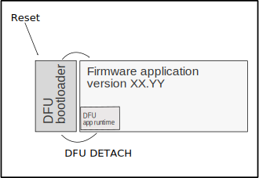

# Firmware examples

This folder contains firmware examples to allow USB based
peripherals to be updated from RHEL.

We use the [STM32F103](https://www.st.com/en/microcontrollers-microprocessors/stm32f103.html)
microcontroller and the [Rust](https://www.rust-lang.org/) language, but the techniques apply to other languages.

Inside the examples, you will find two folders, one for the bootloader and one for the peripheral firmware application.

## Bootloader and Update protocol

We recommend implementing the [DFU](https://www.usb.org/sites/default/files/DFU_1.1.pdf) or DFUse protocols for USB devices since fwupd implements this protocol. Our examples are based on the DFUse version of the protocol.

DFU defines two interfaces, one for the bootloader, which can write, erase (or read if enabled) the application space, and another interface (the runtime interface) which allows the host to request the application to jump back to the bootloader.



We implement the DFU protocol using the [usbd-dfu](https://github.com/vitalyvb/usbd-dfu) Rust
library, which is based on the [usb-device](https://github.com/rust-embedded-community/usb-device) stack, and we build the bootloaders based on the [usbd-dfu-example](https://github.com/vitalyvb/usbd-dfu-example) provided by the author.

## Application

The applications implement the DFU runtime interface (it declares the device to be DFU enabled
and accepts the DFU_DETACH and GET_STATUS commands)

We implement the dfu runtime using the [usbd-dfu-rt](https://github.com/jedrzejboczar/usbd-dfu-rt) Rust library, which is based on the [usb-device](https://github.com/rust-embedded-community/usb-device) stack.

As part of building the application firmware we provide examples on the fwupd xml metadata
as well as .cab file wrapping which then fwupd can consume from a vendor directory, i.e.:

`$ cat /etc/fwupd/remotes.d/vendor-directory.conf`
```ini
[fwupd Remote]
# this remote provides dynamically generated metadata shipped by the OS vendor and can
# be found in /usr/share/fwupd/remotes.d/vendor/firmware
Enabled=true
Title=Vendor (Automatic)
# using `Keyring=none` is required as directory remotes requires the local user to trust the person
# putting the files in the immutable local location.
Keyring=none
MetadataURI=file:///usr/share/fwupd/remotes.d/vendor/firmware
ApprovalRequired=false
```

## Notes on USB

An USB host (in this case the RHEL device) identifies peripherals by their location
in the USB tree as well as the VID/PID. Making sure that your VID/PID is unique
for the specific type of peripheral is important to:
* Avoid conflict with other peripheral drivers
* Helping fwupd match firmwares to peripherals.

For development and under very controlled environments you can pick your VID/PID combination,
for mass produced and publicly sold peripherals [you need to obtain a VID from usb.org](https://www.usb.org/getting-vendor-id), or sublicense a PID from any registered vendor or your chip maker. This is similar for PCIe connected devices.

## Notes on bootloader security

The above examples should be considered just a reference on how to create your
peripheral firmware, and probably a good startint point if you are planning to use Rust.

As a peripheral builder you may want to apply the following considerations depending
on the environment or type of device you are building:

* Adding encryption (decryption at bootloader) to the firmware blob, algorithms like XTEA
  aren't completely secure but can help. AES is better if your device supports it.
* Adding signature/verification to the firmware blobs if your deviced has hardware support.
* Disabling JTAG access on boot.
* Disabling read access (we do this by default).
* Disabling JTAG read access on your device at programming time.

## Notes on BOOT ROM DFU Bootloaders

Some MCUs include their own DFU bootloader in ROM. This avoids the need to write and maintain
your own bootloader. But one disadvantage of using the ROM Bootloader is that 
the VID:PID will be the chip manufaturer's pair, and your peripheral will have
two pairs, one on bootloader mode, and one on the final application.
You will need to indicate this via quirks to fwupd, and it's not recommended, since fwupd
won't be able to recognize and reflash your device if anything goes wrong, since that
VID/PID pair would be shared across many peripherals built on the same chip.

